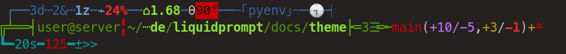

Neon — A Liquid Prompt Theme
============================

Neon is a theme for [Liquid Prompt](https://github.com/nojhan/liquidprompt).

It is based on the default theme but on three lines
and with a more pronounced color scheme.


Preview
-------

If there is nothing special about the current context:


If you are running some command in a Git repository:


When Liquid Prompt is displaying a lot of things, it may look like this:




Rationale
---------

The `neon` theme is an extension of the default theme, featuring a
"techno-ascii-art" style.

This prompt is a fully usable theme, designed to be easier to visually
parse than the default theme.

It is also an example of how to build a theme modifiyng colors and
structure of the sections.

The theme features three rows:

1.  the first one hosting "secondary" information, in blue (jobs,
    sensors, dev context, etc.),
2.  the second row displays "primary" information (user, path, VCS,
    etc.), in green,
3.  the third one is dedicated to the prompt (runtime, error code,
    prompt mark), in cyan.

Within each row, important notice are displayed in bold (and thus
probably in a slightly lighter color, depending on your terminal
configuration).


Install
-------

Just download this repository somewhere, source the theme file and activate the theme from your shell configuration file.

For example (just use `~/.zshrc` instead of `~/.bashrc`, if you use Zsh and not Bash):
```sh
git clone https://github.com/nojhan/lp-neon.git
echo '# Use Liquid Prompt only if in an interactive shell
    if [[ $- == *i* ]]; then
        # Use Liquid Prompt
        source ~/.liquidprompt
        # Use the Neon theme if it has been downloaded in ~.
        if [[ -f ~/lp-neon/neon.theme ]] ; then
            source ~/lp-neon/neon.theme && lp_theme neon
        fi
    fi' >> ~/.bashrc
```

WARNING: Normally with Liquid Prompt's themes,
you may source several themes,
switch between them and get back at the previous one.
However, with Neon, this may not work properly,
because it abuses the Default theme's configuration.


Configuration
-------------

The Neon theme require a font having the Unicode "box drawing"
characters (almost any modern font should work).

### Liquid Prompt Configuration

All Liquid Prompt config options are respected, **except for**:

-   All [`LP_COLOR_*`](https://liquidprompt.readthedocs.io/en/stable/config.html#colors) variables,
-   [`LP_MARK_PREFIX`](https://liquidprompt.readthedocs.io/en/stable/config.html#LP_MARK_PREFIX),
-   [`LP_PS1_POSTFIX`](https://liquidprompt.readthedocs.io/en/stable/config.html#LP_PS1_POSTFIX),
-   [`LP_MARK_MULTIPLEXER_OPEN`](https://liquidprompt.readthedocs.io/en/stable/config.html#LP_MARK_MULTIPLEXER_OPEN)
    (superseeded by `NEON_MARK_MULTIPLEXER_OPEN`),
-   [`LP_MARK_MULTIPLEXER_CLOSE`](https://liquidprompt.readthedocs.io/en/stable/config.html#LP_MARK_MULTIPLEXER_CLOSE)
    (superseeded by `NEON_MARK_MULTIPLEXER_CLOSE`),
-   [`LP_MARK_PERM`](https://liquidprompt.readthedocs.io/en/stable/config.html#LP_MARK_PERM) (superseeded by
    `NEON_MARK_PERM`),
-   [`LP_MARK_SHORTEN_PATH`](https://liquidprompt.readthedocs.io/en/stable/config.html#LP_MARK_SHORTEN_PATH) (superseeded
    by `NEON_MARK_SHORTEN_PATH`),
-   [`LP_MARK_DIRSTACK`](https://liquidprompt.readthedocs.io/en/stable/config.html#LP_MARK_DIRSTACK) (superseeded by
    `NEON_MARK_DIRSTACK`),
-   [`LP_MARK_SHLVL`](https://liquidprompt.readthedocs.io/en/stable/config.html#LP_MARK_SHLVL) (superseeded by
    `NEON_MARK_SHLVL`),
-   [`LP_MARK_JOBS_SEPARATOR`](https://liquidprompt.readthedocs.io/en/stable/config.html#LP_MARK_JOBS_SEPARATOR) (superseeded
    by `NEON_MARK_JOBS_SEPARATOR`),
-   [`LP_MARK_WIFI`](https://liquidprompt.readthedocs.io/en/stable/config.html#LP_MARK_WIFI) (superseeded by
    `NEON_MARK_WIFI`),
-   [`LP_MARK_BRACKET_OPEN`](https://liquidprompt.readthedocs.io/en/stable/config.html#LP_MARK_BRACKET_OPEN) (superseeded
    by `NEON_MARK_BRACKET_OPEN`),
-   [`LP_MARK_BRACKET_CLOSE`](https://liquidprompt.readthedocs.io/en/stable/config.html#LP_MARK_BRACKET_CLOSE) (superseeded
    by `NEON_MARK_BRACKET_CLOSE`).

### Theme Configuration

Neon adds the following config options.

#### Colors

**NEON_PRIMARY_COLOR**: *array<int> = (.)*

Color used for the "primary" row.


**NEON_PRIMARYBOLD_COLOR**: *array<int> = (2 -1 1 0 2 -1)*

Color used for important info in the primary row.


**NEON_SECONDARY_COLOR**: *array<int> = (4 -1 0 0 4 -1)*

Color used for the "secondary" row.


**NEON_SECONDARYBOLD_COLOR**: *array<int> = (4 -1 1 0 4 -1)*

Color used for important info in the secondary row.


**NEON_PROMPT_COLOR**: *array<int> = (6 -1 0 0 6 -1)*

Color used for the "prompt" row.


**NEON_WARN_COLOR**: *array<int> = (1 -1 0 0 1 -1)*

Color used for warning-related info, in all rows.


#### Markers

**NEON_MARK_BRACKET_OPEN** *string = "┥"*

Marker used as a value for [`LP_MARK_BRACKET_OPEN`](https://liquidprompt.readthedocs.io/en/stable/config.html#LP_MARK_BRACKET_OPEN)


**NEON_MARK_BRACKET_CLOSE** *string = "┝"*

Marker used as a value for [`LP_MARK_BRACKET_CLOSE`](https://liquidprompt.readthedocs.io/en/stable/config.html#LP_MARK_BRACKET_CLOSE)


**NEON_MARK_MULTIPLEXER_OPEN** *string = "╣"*

Marker used as a value for [`LP_MARK_MULTIPLEXER_OPEN`](https://liquidprompt.readthedocs.io/en/stable/config.html#LP_MARK_MULTIPLEXER_OPEN)


**NEON_MARK_MULTIPLEXER_CLOSE** *string = "╠"*

Marker used as a value for [`LP_MARK_MULTIPLEXER_CLOSE`](https://liquidprompt.readthedocs.io/en/stable/config.html#LP_MARK_MULTIPLEXER_CLOSE)


**NEON_MARK_PERM** *string = "╏"*

Marker used as a value for [`LP_MARK_PERM`](https://liquidprompt.readthedocs.io/en/stable/config.html#LP_MARK_PERM)


**NEON_MARK_SHORTEN_PATH** *string = "┈"*

Marker used as a value for [`LP_MARK_SHORTEN_PATH`](https://liquidprompt.readthedocs.io/en/stable/config.html#LP_MARK_SHORTEN_PATH)


**NEON_MARK_DIRSTACK** *string = "☰"*

Marker used as a value for [`LP_MARK_DIRSTACK`](https://liquidprompt.readthedocs.io/en/stable/config.html#LP_MARK_DIRSTACK)


**NEON_MARK_SHLVL** *string = ""*

Marker used as a value for [`LP_MARK_SHLVL`](https://liquidprompt.readthedocs.io/en/stable/config.html#LP_MARK_SHLVL)


**NEON_MARK_JOBS_SEPARATOR** *string = "┄"*

Marker used as a value for [`LP_MARK_JOBS_SEPARATOR`](https://liquidprompt.readthedocs.io/en/stable/config.html#LP_MARK_JOBS_SEPARATOR)


**NEON_MARK_WIFI** *string = "╜"*

Marker used as a value for [`LP_MARK_WIFI`](https://liquidprompt.readthedocs.io/en/stable/config.html#LP_MARK_WIFI)

